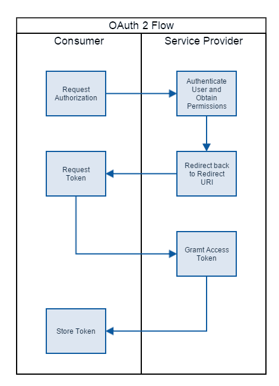

# Read:32 - OAUTH

## Microsoft Docs: Facebook, Google, and external provider authentication in ASP.NET Core

Enabling users to sign in using OAuth 2.0 with credentials has many advantages. Facebook, Twitter, Google, and Microsoft enable users to sign in with their existing credentials and:

- Is convenient for the users.
- Shifts many of the complexities of managing the sign-in process onto a third party.

Social logins have been documented to drive traffic and customer conversions because it links your site to other sites that the user already trusts and helps the customer think that their data is safe.

## Jerrie Pelser: Authenticate with OAuth 2.0 in ASP.NET Core 2.0

### The OAuth Flow:

1. The Consumer makes a request to the Service Provider authorization endpoint to authorize the user.
2. The Service Provider authenticates the user and prompts them whether to authorize the Consumer to access their information.
3. If the user authorizes the Consumer, the Service Provider redirects back to the redirect URI on the Consumer's website with a temporary access code.
4. The Consumer calls the token endpoint on the Service Provider website to exchange the code for a more permanent access token.
5. The Service Provider grants an access token which can be used to authenticate subsequent requests to protected resources.

The important parts you need when configuring the generic OAuth provider are:

1. The Client ID
2. The Client secret
3. The Redirect URI
4. The Authorization endpoint
5. The Token endpoint